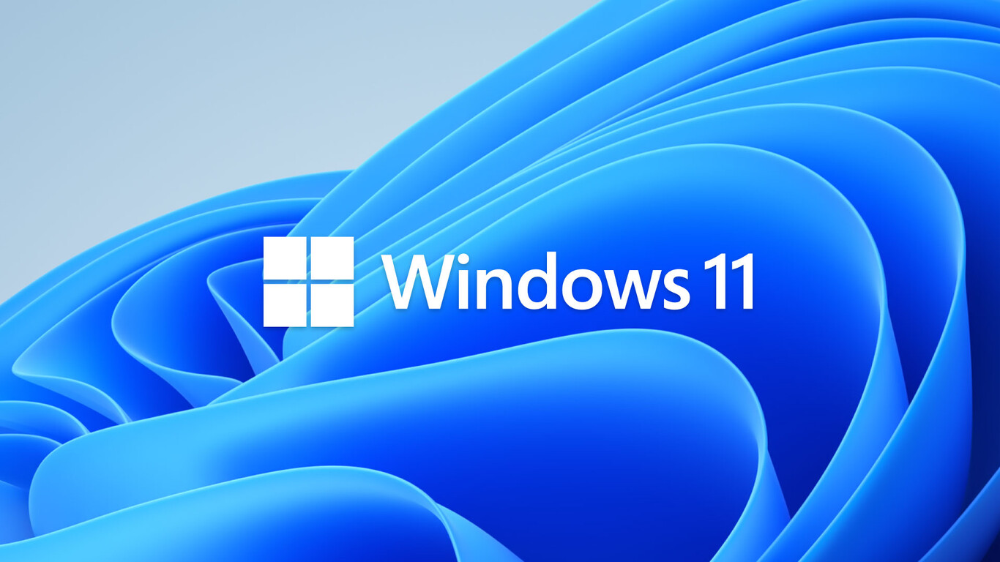
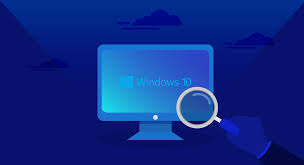
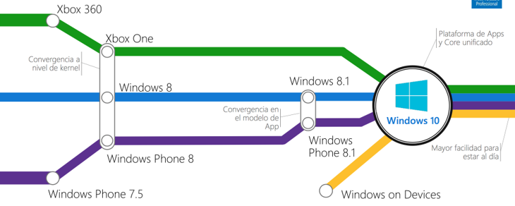
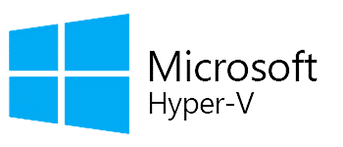

# 

---

## ¿Qué es Windows 11?

Windows 11 es la última versión del sistema operativo desarrollado por Microsoft, lanzado en 2021 como sucesor de Windows 10. Ofrece una serie de nuevas características y mejoras en comparación con versiones anteriores.

---

## Características principales

- **Nuevo diseño**: Windows 11 presenta un diseño moderno y simplificado, con esquinas redondeadas y una barra de tareas centrada.
- **Menor consumo de recursos**: Se han realizado optimizaciones para mejorar el rendimiento y reducir el consumo de recursos del sistema.
- **Compatibilidad con aplicaciones de Android**: Windows 11 ofrece soporte para ejecutar aplicaciones de Android a través de la Microsoft Store.
- **Mejoras en la productividad**: Se han introducido nuevas funciones para mejorar la productividad, como escritorios virtuales mejorados y una experiencia de juego mejorada.

---

## Requisitos del sistema

Para ejecutar Windows 11, se requieren ciertos requisitos del sistema, que incluyen:

- Procesador de 64 bits con al menos 1 GHz de velocidad de reloj.
- 4 GB de RAM o más.
- Al menos 64 GB de almacenamiento disponible.
- Tarjeta gráfica compatible con DirectX 12 o posterior.
- Pantalla con resolución de al menos 720p.
- TPM (Módulo de plataforma segura) versión 2.0.
- UEFI compatible con Secure Boot.
- Conexión a internet y cuenta de Microsoft para algunas características.

---

## Interfaz de Usuario

La interfaz de usuario de Windows 11 ha sido completamente rediseñada para ofrecer una experiencia más moderna y fluida. Las esquinas redondeadas, la barra de tareas centrada y el nuevo menú de inicio son algunas de las características más destacadas de su nuevo aspecto.

---

## Evolución de Windows

Windows ha experimentado una evolución significativa a lo largo de los años, desde sus primeras versiones hasta llegar a Windows 11. Cada versión ha introducido nuevas características, mejoras de rendimiento y cambios en la interfaz de usuario para adaptarse a las necesidades cambiantes de los usuarios y las tecnologías emergentes.

---

## Cuenta de Microsoft

Una cuenta de Microsoft es necesaria para acceder a muchas de las características y servicios ofrecidos por Windows 11. Esta cuenta permite la sincronización de datos entre dispositivos, acceso a la tienda de aplicaciones de Microsoft y la activación de funciones como el inicio de sesión único y la autenticación multifactor.

---

## Hyper-V

Hyper-V es una característica de Windows 11 que permite la virtualización de sistemas operativos. Con Hyper-V, los usuarios pueden crear y ejecutar máquinas virtuales en sus dispositivos Windows 11, lo que les permite probar software, configuraciones de red y realizar otras tareas de virtualización sin necesidad de hardware adicional.

---

## Conclusiones

Windows 11 representa una evolución significativa en el ecosistema de sistemas operativos de Microsoft. Con su diseño moderno, mejoras de rendimiento y nuevas características, ofrece una experiencia mejorada para los usuarios.

¡Gracias!
